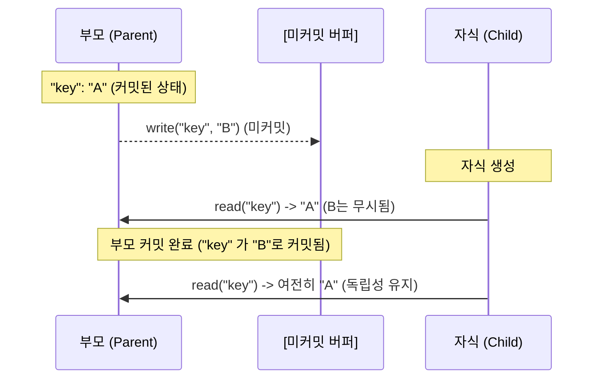

# mvcc-api

TypeScript를 위한 다중 버전 동시성 제어(Multiversion Concurrency Control, MVCC) API입니다.

이 라이브러리는 MVCC를 사용하여 스냅샷 격리(Snapshot Isolation, SI)를 구현하기 위한 강력한 프레임워크를 제공합니다. 동기 및 비동기 작업을 모두 지원하며 유연한 중첩 트랜잭션 시스템을 특징으로 합니다.

## 핵심 특징 (Key Features)

| 특징 | 설명 |
| :--- | :--- |
| **MVCC 지원** | 스냅샷 격리를 통해 읽기/쓰기 작업 간의 차단을 방지합니다. |
| **엄격한 가시성** | 자식 트랜잭션은 생성 시점에 부모(조상)가 커밋한 최신 데이터만 볼 수 있습니다. |
| **재사용 가능 루트** | 루트 트랜잭션은 닫히지 않고 여러 번 커밋할 수 있어 지속적인 저장소 연결을 유지합니다. |
| **일관된 API** | 루트와 중첩 트랜잭션이 동일한 인터페이스를 공유하여 개발 복잡도를 낮춥니다. |
| **무제한 중첩** | 활성 상태의 어떤 트랜잭션에서도 새로운 자식 트랜잭션을 무제한으로 생성할 수 있습니다. |
| **저장소 유연성** | 전략(Strategy) 패턴을 통해 파일 시스템, DB 등 모든 저장소 확장이 가능합니다. |

## 설치 (Installation)

### Node.js
```bash
npm install mvcc-api
```

### ES Module (CDN)
```javascript
import { AsyncMVCCTransaction, AsyncMVCCStrategy } from 'https://cdn.jsdelivr.net/npm/mvcc-api@1/+esm'
```

## 사용법 (Usage)

### 1. 전략(Strategy) 구현
`MVCCStrategy`를 확장하여 데이터 저장 방식을 정의합니다.

```typescript
import fs from 'node:fs'
import { AsyncMVCCStrategy } from 'mvcc-api'

export class AsyncFileStrategy extends AsyncMVCCStrategy<string, string> {
  async read(key: string): Promise<string> {
    return fs.promises.readFile(key, 'utf-8')
  }
  async write(key: string, value: string): Promise<void> {
    await fs.promises.writeFile(key, value, 'utf-8')
  }
  async delete(key: string): Promise<void> {
    await fs.promises.unlink(key)
  }
  async exists(key: string): Promise<boolean> {
    return fs.existsSync(key)
  }
}
```

### 2. 트랜잭션 실행
구현한 전략으로 루트 트랜잭션을 초기화합니다. 격리된 작업을 위해 중첩 트랜잭션을 생성할 수 있습니다.

```typescript
import { AsyncMVCCTransaction } from 'mvcc-api'
import { AsyncFileStrategy } from './AsyncFileStrategy'

async function main() {
  const strategy = new AsyncFileStrategy()
  const root = new AsyncMVCCTransaction(strategy) // 루트 트랜잭션 (영구적)

  const tx = root.createNested() // 중첩 트랜잭션 시작

  try {
    tx.write('data.json', JSON.stringify({ status: 'active' }))
    const data = await tx.read('data.json') // 자신의 변경사항 확인 가능
    
    await tx.commit()   // 부모(Root) 버퍼로 병합
    await root.commit() // 저장소에 영구 반영
  } catch (err) {
    tx.rollback()
  }
}
```

## 아키텍처 및 가시성 (Architecture & Visibility)

자식 트랜잭션은 생성되는 순간, 부모가 확정한 상태에 대한 불변 스냅샷을 생성합니다.



> [!IMPORTANT]
> **가시성 제어 규칙 (Visibility Rules)**
> 1. **자기 가시성**: 트랜잭션은 자신의 커밋되지 않은 변경 사항을 항상 볼 수 있습니다.
> 2. **엄격한 격리**: 자식 트랜잭션은 생성 시점에 부모(조상 포함)가 마지막으로 **커밋(Commit)**하여 반영한 최신 데이터만 볼 수 있습니다. 부모의 미커밋 버퍼는 절대 노출되지 않습니다.
> 3. **스냅샷 유지**: 자식이 생성된 후에는 외부에서 어떠한 커밋이 발생하더라도, 자식이 종료되기 전까지는 생성 시점의 데이터를 그대로 유지합니다.

## API 레퍼런스 (API Reference)

### `MVCCTransaction<S, K, T>`

| 메서드 | 설명 | 비고 |
| :--- | :--- | :--- |
| `read(key)` | 로컬 버퍼 또는 커밋된 스냅샷에서 값을 읽습니다. | - |
| `write(key, value)` | 쓰기 작업을 버퍼에 기록합니다. | - |
| `delete(key)` | 삭제 작업을 버퍼에 기록합니다. | - |
| `commit()` | 변경 사항을 상위 또는 저장소에 반영합니다. | 중첩 트랜잭션은 커밋 후 자동 종료 |
| `rollback()` | 모든 로컬 변경 사항을 폐기합니다. | 중첩 트랜잭션은 종료됨 |
| `createNested()` | 새로운 자식 트랜잭션을 생성합니다. | **활성 상태**인 트랜잭션에서만 호출 가능 |

### `MVCCStrategy<K, T>` (추상 클래스)

| 메서드 | 설명 |
| :--- | :--- |
| `read(key)` | 저장소에서 값을 읽어옵니다. |
| `write(key, value)` | 저장소에 값을 기록합니다. |
| `delete(key)` | 저장소에서 값을 삭제합니다. |
| `exists(key)` | 키의 존재 여부를 확인합니다. |

## 라이선스 (License)
MIT
