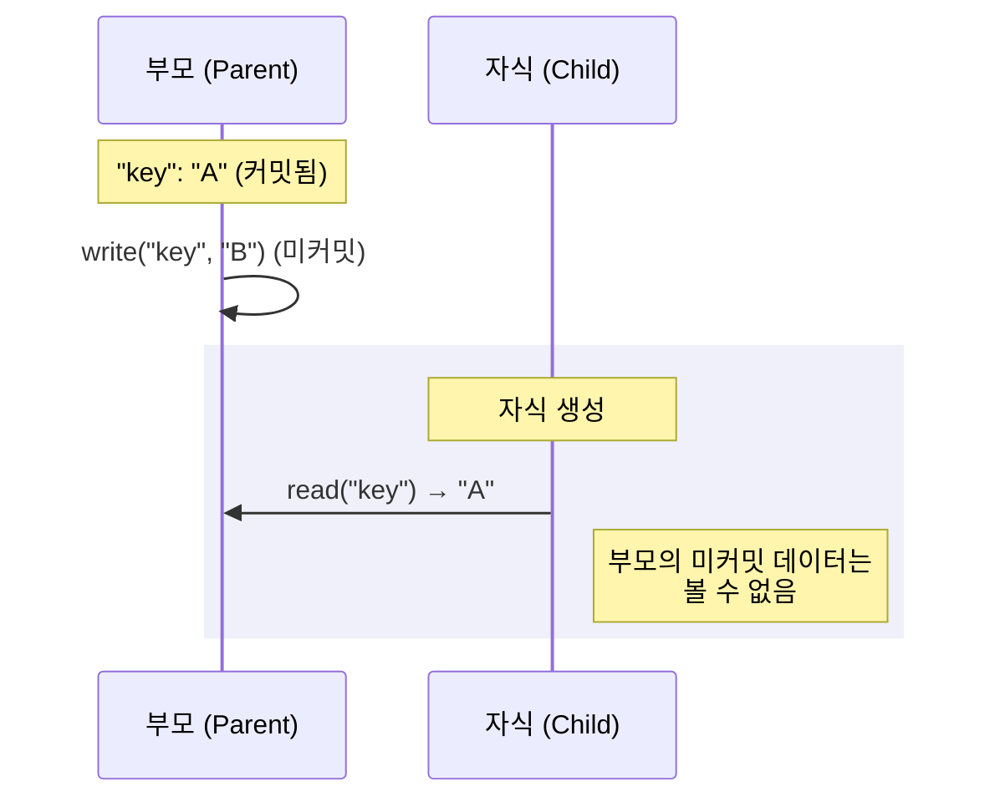

# mvcc-api

TypeScript를 위한 다중 버전 동시성 제어(MVCC) API입니다.

스냅샷 격리(Snapshot Isolation)를 구현하며, 동기/비동기 작업과 유연한 중첩 트랜잭션을 지원합니다.

## 핵심 특징

| 특징 | 설명 |
| :--- | :--- |
| **MVCC 지원** | 스냅샷 격리를 통해 읽기/쓰기 간 차단 방지 |
| **엄격한 격리** | 자식은 부모가 커밋한 데이터만 볼 수 있음 |
| **재사용 가능 루트** | 루트 트랜잭션은 여러 번 커밋 가능 |
| **충돌 감지** | 같은 키를 수정한 트랜잭션 간 자동 충돌 감지 |
| **결과 추적** | commit/rollback 시 생성/수정/삭제된 키 목록 반환 |

## 설치

```bash
npm install mvcc-api
```

## 사용법

### 1. 전략(Strategy) 구현

```typescript
import fs from 'node:fs'
import { AsyncMVCCStrategy } from 'mvcc-api'

export class FileStrategy extends AsyncMVCCStrategy<string, string> {
  async read(key: string) { return fs.promises.readFile(key, 'utf-8') }
  async write(key: string, value: string) { await fs.promises.writeFile(key, value) }
  async delete(key: string) { await fs.promises.unlink(key) }
  async exists(key: string) { return fs.existsSync(key) }
}
```

### 2. 트랜잭션 실행

```typescript
import { AsyncMVCCTransaction } from 'mvcc-api'

const root = new AsyncMVCCTransaction(new FileStrategy())
const tx = root.createNested()

tx.create('new.json', '{}')        // 새 키 생성
tx.write('config.json', '{"v":2}') // 기존 키 수정
tx.delete('old.json')              // 키 삭제

const result = await tx.commit()
// { success: true, created: ['new.json'], updated: ['config.json'], deleted: ['old.json'] }

await root.commit() // 저장소에 영구 반영
```

## 가시성 규칙



> [!IMPORTANT]
> **가시성 규칙**
> - 트랜잭션은 자신의 변경사항을 항상 볼 수 있음
> - 자식은 생성 시점에 **커밋된 데이터만** 볼 수 있음
> - 생성 후 외부 커밋이 발생해도 스냅샷 유지

## 충돌 감지

같은 키를 수정한 트랜잭션은 커밋 시 충돌이 발생합니다.

```typescript
const parent = root.createNested()
const child = parent.createNested()

parent.write('shared', 'parent')  // 자식 생성 후 부모가 수정
child.write('shared', 'child')    // 같은 키 수정

child.commit() // Error: Commit conflict
```

| 부모 수정 | 자식 수정 | 결과 |
|:---:|:---:|:---:|
| `A` | `A` | ❌ 충돌 |
| `A` | `B` | ✅ 성공 |

## 결과 누적

자식이 커밋하면 부모 결과에 누적됩니다.

```typescript
const b = a.createNested()
const c = b.createNested()

c.create('C', 'val')
c.commit()  // { created: ['C'] }

b.create('B', 'val')
b.commit()  // { created: ['C', 'B'] } ← c의 결과 포함
```

> [!NOTE]
> **롤백된 자식의 변경사항은 부모에게 전달되지 않습니다.**

## API 레퍼런스

### `MVCCTransaction<S, K, T>`

| 메서드 | 설명 | 반환값 |
| :--- | :--- | :--- |
| `create(key, value)` | 새 키-값 생성 | `this` |
| `write(key, value)` | 기존 키 수정 | `this` |
| `delete(key)` | 키 삭제 | `this` |
| `read(key)` | 값 읽기 | `T \| null` |
| `commit()` | 변경사항 반영 | `TransactionResult<K>` |
| `rollback()` | 변경사항 폐기 | `TransactionResult<K>` |
| `createNested()` | 자식 트랜잭션 생성 | `MVCCTransaction` |

### `TransactionResult<K>`

```typescript
{
  success: boolean    // 성공 여부
  created: K[]        // create()로 생성된 키
  updated: K[]        // write()로 수정된 키
  deleted: K[]        // delete()로 삭제된 키
}
```

## 라이선스
MIT
