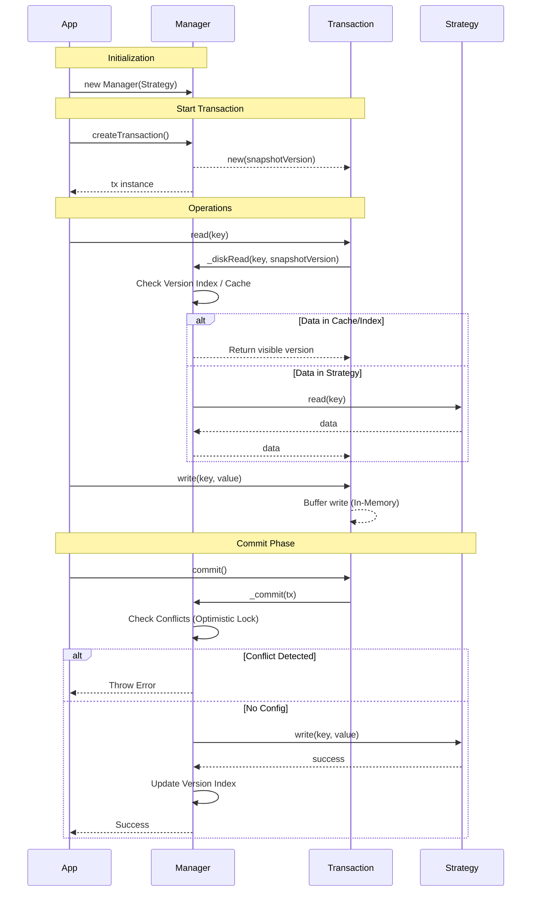

[](https://www.jsdelivr.com/package/npm/mvcc-api)


# mvcc-api

Multiversion Concurrency Control (MVCC) API for TypeScript.

This library provides a robust framework for implementing Snapshot Isolation (SI) using MVCC. It supports both synchronous and asynchronous operations and is designed to be storage-agnostic via the Strategy pattern.

## Features

- **MVCC (Multiversion Concurrency Control)**: Provides Snapshot Isolation, allowing readers to not block writers and vice versa.
- **Sync & Async Support**: Separate `SyncMVCCManager` and `AsyncMVCCManager` for different use cases.
- **Storage Agnostic**: Implement your own `Strategy` (e.g., File System, In-Memory, Key-Value Store) to handle actual data persistence.
- **Transaction Management**: Methods to `create`, `commit`, and `rollback` transactions easily.

## Installation

### Node.js

```bash
npm install mvcc-api
```

### ES Module

```javascript
import {
  AsyncMVCCManager,
  AsyncMVCCStrategy
} from 'https://cdn.jsdelivr.net/npm/mvcc-api@1/+esm'
```

## Usage

### 1. Implement a Strategy

First, you need to define how data is stored by extending `MVCCStrategy`. Here is a simple example using Node.js `node:fs`.

```typescript
import fs from 'node:fs'
import { AsyncMVCCStrategy } from 'mvcc-api'

export class AsyncFileStrategy extends AsyncMVCCStrategy<string, string> {
  async read(key: string): Promise<string> {
    return fs.promises.readFile(key, 'utf-8')
  }
  async write(key: string, value: string): Promise<void> {
    await fs.promises.writeFile(key, value, 'utf-8')
  }
  async delete(key: string): Promise<void> {
    await fs.promises.unlink(key)
  }
  async exists(key: string): Promise<boolean> {
    return fs.existsSync(key)
  }
}
```

### 2. Run Transactions

Initialize the Manager with your Strategy and start using transactions.

```typescript
import { AsyncMVCCManager } from 'mvcc-api'
import { AsyncFileStrategy } from './AsyncFileStrategy' // Your strategy

async function main() {
  const strategy = new AsyncFileStrategy()
  const db = new AsyncMVCCManager(strategy)

  // Start a transaction
  const tx = db.createTransaction()

  try {
    // Write data (buffered in memory)
    tx.write('user-1.json', JSON.stringify({ name: 'Alice', balance: 100 }))

    // Read data (snapshot isolation)
    const data = await tx.read('user-1.json')
    console.log('Read within tx:', data) 

    // Commit changes to storage
    await tx.commit()
    console.log('Transaction committed!')
  } catch (err) {
    console.error('Transaction failed:', err)
    tx.rollback()
  }
}

main()
```

## Architecture

The follow diagram illustrates the flow of a transaction in `mvcc-api`.



## API Reference

### `MVCCStrategy<K, T>` (Abstract)
- `read(key: K): Deferred<T>`
- `write(key: K, value: T): Deferred<void>`
- `delete(key: K): Deferred<void>`
- `exists(key: K): Deferred<boolean>`

### `MVCCManager<S, K, T>`
- `createTransaction(): Transaction`
- `version`: Current global version.

### `MVCCTransaction<S, K, T>`
- `read(key: K): Deferred<T | null>`
- `write(key: K, value: T): this`
- `delete(key: K): this`
- `commit(): Deferred<this>`
- `rollback(): this`

## License

MIT
