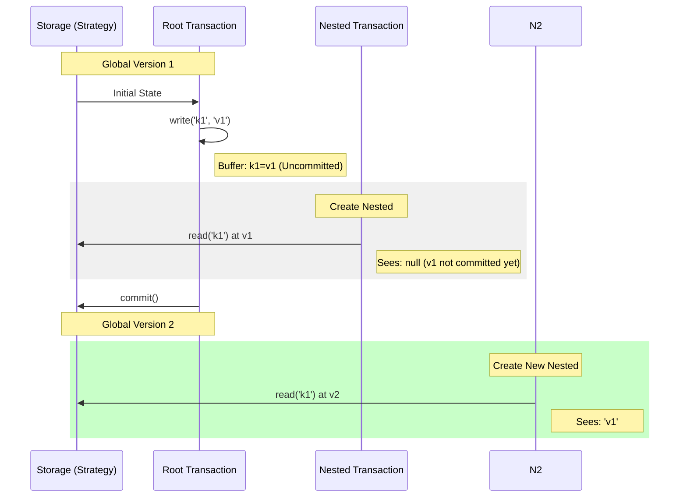

[](https://www.jsdelivr.com/package/npm/mvcc-api)


# mvcc-api

Multiversion Concurrency Control (MVCC) API for TypeScript.

This library provides a robust framework for implementing Snapshot Isolation (SI) using MVCC. It supports both synchronous and asynchronous operations and features a flexible nested transaction system.

## Features

- **MVCC (Multiversion Concurrency Control)**: Provides Snapshot Isolation, allowing readers to not block writers and vice versa.
- **Strict Committed-Only Visibility**: Nested transactions only see data that has been globally committed. Uncommitted changes in parent buffers are isolated from child transactions.
- **Reusable Root Transaction**: The Root transaction serves as a persistent gateway to storage and can be committed multiple times without being closed.
- **Unified Transaction Architecture**: Root and Nested transactions share the same API, simplifying complex workflows.
- **Indefinite Nesting**: Create child transactions from any existing transaction with proper conflict detection.
- **Storage Agnostic**: Implement your own `Strategy` (e.g., File System, In-Memory, Key-Value Store) via the Strategy pattern.

## Installation

### Node.js

```bash
npm install mvcc-api
```

### ES Module (via CDN)

```javascript
import {
  AsyncMVCCTransaction,
  AsyncMVCCStrategy
} from 'https://cdn.jsdelivr.net/npm/mvcc-api@1/+esm'
```

## Usage

### 1. Implement a Strategy

Define how data is stored by extending `MVCCStrategy`.

```typescript
import fs from 'node:fs'
import { AsyncMVCCStrategy } from 'mvcc-api'

export class AsyncFileStrategy extends AsyncMVCCStrategy<string, string> {
  async read(key: string): Promise<string> {
    return fs.promises.readFile(key, 'utf-8')
  }
  async write(key: string, value: string): Promise<void> {
    await fs.promises.writeFile(key, value, 'utf-8')
  }
  async delete(key: string): Promise<void> {
    await fs.promises.unlink(key)
  }
  async exists(key: string): Promise<boolean> {
    return fs.existsSync(key)
  }
}
```

### 2. Run Transactions

Initialize a root transaction with your strategy. You can then create nested transactions for isolated work.

```typescript
import { AsyncMVCCTransaction } from 'mvcc-api'
import { AsyncFileStrategy } from './AsyncFileStrategy'

async function main() {
  const strategy = new AsyncFileStrategy()
  // Create a Root Transaction (it can be committed multiple times)
  const root = new AsyncMVCCTransaction(strategy)

  // Start a Nested Transaction for isolated work
  const tx = root.createNested()

  try {
    tx.write('data.json', JSON.stringify({ status: 'active' }))
    
    // Child sees its own buffer, but parent's uncommitted buffer is hidden
    const data = await tx.read('data.json')
    
    // Commit merges changes up to the parent (Root)
    await tx.commit()
    
    // Root must commit to persist to storage
    await root.commit()
  } catch (err) {
    tx.rollback()
  }
}
```

## Architecture & Visibility

The following diagram illustrates how visibility and data flow work in `mvcc-api`. Child transactions create an immutable snapshot of the **globally committed state** at the moment of their creation.



### Visibility Rules
1. **Self-Visibility**: A transaction always sees its own uncommitted changes.
2. **Strict Isolation**: A child transaction **cannot** see its parent's uncommitted buffer. It only sees data committed to the storage at the time of the child's creation.
3. **Snapshot Integrity**: Once a child is created, it will never see any subsequent commits made by other transactions (including its parent) until it is closed.

## API Reference

### `MVCCTransaction<S, K, T>` (Sync/Async)
- **Constructor**: `new SyncMVCCTransaction(strategy?)` or `new AsyncMVCCTransaction(strategy?)`
  - Pass a `strategy` only for the Root transaction.
- `read(key: K)`: Reads value from local buffer or globally committed snapshot.
- `write(key: K, value: T)`: Buffers a write operation.
- `delete(key: K)`: Buffers a delete operation.
- `commit()`: 
  - **Root**: Persists all buffered changes to storage and resets local buffers. The Root remains open for further operations.
  - **Nested**: Merges changes into the parent's buffer and closes the transaction.
- `rollback()`: Discards all local changes and closes the transaction (if Nested).
- `createNested()`: Creates a new child transaction with a snapshot of the current globally committed state.

### `MVCCStrategy<K, T>` (Abstract)
- `read(key: K)`
- `write(key: K, value: T)`
- `delete(key: K)`
- `exists(key: K)`

## License

MIT
