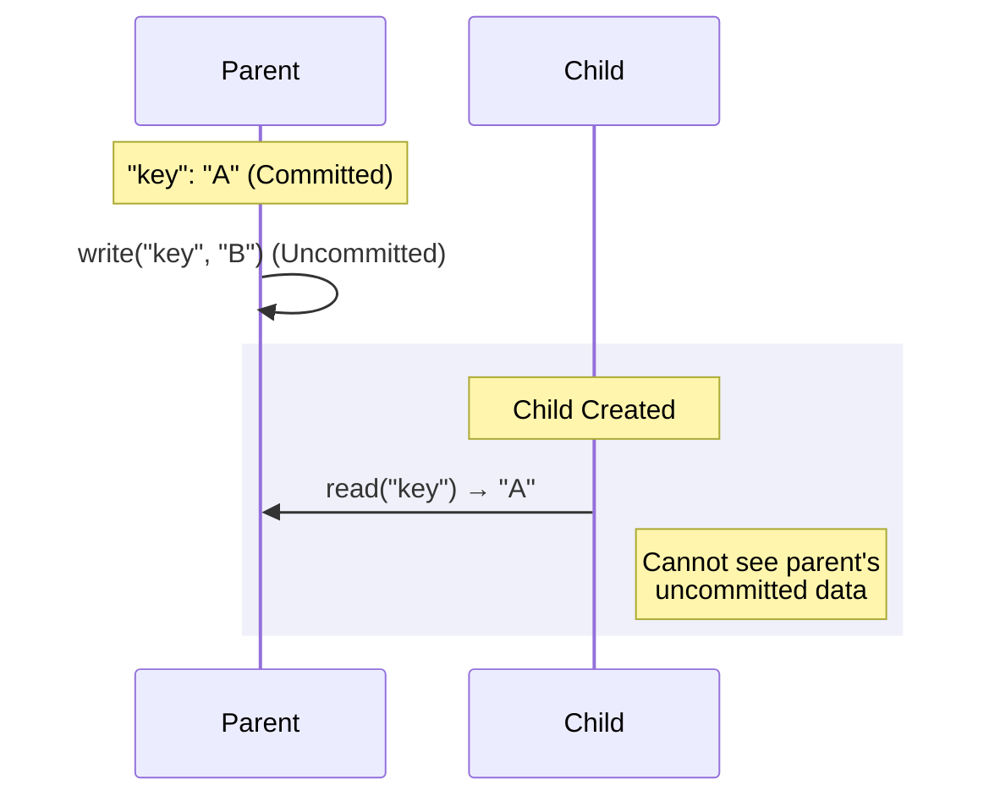

[](https://www.jsdelivr.com/package/npm/mvcc-api)


# mvcc-api

Multiversion Concurrency Control (MVCC) API for TypeScript.

It implements Snapshot Isolation and supports synchronous/asynchronous operations and flexible nested transactions.

## Key Features

| Feature | Description |
| :--- | :--- |
| **MVCC Support** | Prevents blocking between reads/writes via Snapshot Isolation |
| **Strict Isolation** | Children can only see data committed by their parents |
| **Reusable Root** | Root transaction can be committed multiple times |
| **Conflict Detection** | Automatic conflict detection between transactions modifying the same key |
| **Result Tracking** | Returns list of created/updated/deleted keys and data upon commit/rollback |

## Why `mvcc-api`?

It easily and powerfully solves complex concurrency problems that are difficult to handle with simple file I/O or data manipulation.

1.  **High-Performance Non-blocking Reads**
    *   Read operations do not wait even if write operations are in progress.
    *   Snapshot Isolation always provides data from a consistent point in time.

2.  **Perfect Atomicity (All-or-Nothing)**
    *   Bundles changes to multiple files or data into a single transaction.
    *   If it fails midway, all changes are cleanly cancelled. No worries about data corruption due to partial updates.

3.  **Flexible Storage Extension**
    *   You can apply MVCC features to anything—file systems, in-memory objects, local storage, etc.—just by implementing the `Strategy` interface.
    *   Business logic and storage logic can be perfectly separated.

4.  **Improved Development Productivity**
    *   No need to write complex synchronization code yourself; write safe code with just intuitive `api.read()`, `api.write()`, and `commit()`.

## Installation

```bash
npm install mvcc-api
```

## Usage

### 1. Implement Strategy

```typescript
import fs from 'node:fs'
import { AsyncMVCCStrategy } from 'mvcc-api'

export class FileStrategy extends AsyncMVCCStrategy<string, string> {
  async read(key: string) {
    return fs.promises.readFile(key, 'utf-8')
  }
  async write(key: string, value: string) {
    await fs.promises.writeFile(key, value)
  }
  async delete(key: string) {
    await fs.promises.unlink(key)
  }
  async exists(key: string) {
    return fs.existsSync(key)
  }
}
```

### 2. Execute Transaction

```typescript
import { AsyncMVCCTransaction } from 'mvcc-api'

const root = new AsyncMVCCTransaction(new FileStrategy())
const tx = root.createNested()

tx.create('new.json', '{}')        // Create new key
tx.write('config.json', '{"v":2}') // Update existing key
tx.delete('old.json')              // Delete key

const result = await tx.commit()
// result.created = [{ key: 'new.json', data: '{}' }]
// result.updated = [{ key: 'config.json', data: '{"v":2}' }]
// result.deleted = [{ key: 'old.json', data: '<value before delete>' }]

await root.commit() // Persist to storage
```

## Visibility Rules



> [!IMPORTANT]
> **Visibility Rules**
> - Transactions can always see their own changes.
> - Children can only see **committed data** at the time of creation.
> - Snapshots are maintained even if external commits occur after creation.

## Conflict Detection

Conflicts occur upon commit if transactions have modified the same key.

```typescript
const parent = root.createNested()
const child = parent.createNested()

parent.write('shared', 'parent')  // Parent modifies after child creation
child.write('shared', 'child')    // Child modifies same key

const result = child.commit()
if (!result.success) {
  console.log(result.error) // "Commit conflict: Key 'shared' was modified..."
}
```

| Parent Mod | Child Mod | Result |
|:---:|:---:|:---:|
| `A` | `A` | ❌ Conflict |
| `A` | `B` | ✅ Success |

> [!TIP]
> **No Conflict on Different Keys**
>
> MVCC detects conflicts on a **Key basis**. Sibling transactions can both commit successfully if they modify **different keys**.
>
> ```typescript
> const t1 = root.createNested()
> const t2 = root.createNested()
>
> t1.create('Key1', 'data')
> t2.create('Key2', 'data') // Different key
>
> t1.commit() // Success
> t2.commit() // Success
> ```

## Result Accumulation

When a child commits, the results are accumulated in the parent.

```typescript
const b = a.createNested()
const c = b.createNested()

c.create('C', 'val')
const cResult = c.commit()
// cResult.created = [{ key: 'C', data: 'val' }]

b.create('B', 'val')
const bResult = b.commit()
// bResult.created = [{ key: 'C', data: 'val' }, { key: 'B', data: 'val' }]
```

> [!NOTE]
> **Changes from rolled-back children are not passed to the parent.**

## API Reference

### `MVCCTransaction<S, K, T>`

| Method | Description | Return Value |
| :--- | :--- | :--- |
| `create(key, value)` | Create new key-value | `this` |
| `write(key, value)` | Update existing key | `this` |
| `delete(key)` | Delete key | `this` |
| `read(key)` | Read value | `T \| null` |
| `commit()` | Apply changes | `TransactionResult<K, T>` |
| `rollback()` | Discard changes | `TransactionResult<K, T>` |
| `createNested()` | Create child transaction | `MVCCTransaction` |

### `TransactionResult<K, T>`

```typescript
type TransactionEntry<K, T> = { key: K, data: T }

{
  success: boolean              // Success status
  error?: string                // Error message on failure (e.g. conflict)
  created: TransactionEntry[]   // Keys and values created via create()
  updated: TransactionEntry[]   // Keys and values updated via write()
  deleted: TransactionEntry[]   // Keys deleted via delete() and their previous values
}
```

## Contributing

`mvcc-api` aims to help anyone easily use complex concurrency control.
Bug reports, feature suggestions, and PRs are always welcome! Please feel free to leave your feedback via GitHub Issues.

## License
MIT
