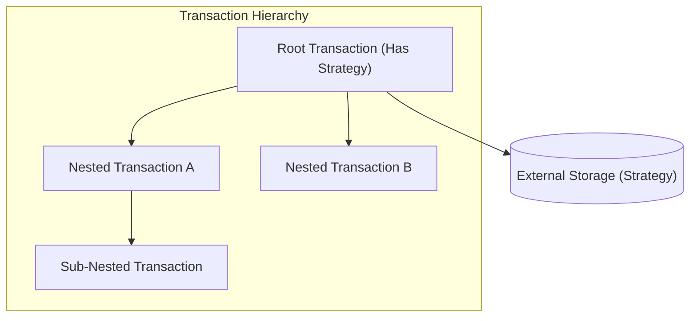

[](https://www.jsdelivr.com/package/npm/mvcc-api)


# mvcc-api

Multiversion Concurrency Control (MVCC) API for TypeScript.

This library provides a robust framework for implementing Snapshot Isolation (SI) using MVCC. It supports both synchronous and asynchronous operations and features a flexible nested transaction system.

## Features

- **MVCC (Multiversion Concurrency Control)**: Provides Snapshot Isolation, allowing readers to not block writers and vice versa.
- **Unified Transaction Architecture**: Root and Nested transactions share the same API, simplifying complex workflows.
- **Indefinite Nesting**: Create child transactions from any existing transaction with proper conflict detection.
- **Storage Agnostic**: Implement your own `Strategy` (e.g., File System, In-Memory, Key-Value Store) via the Strategy pattern.
- **Sync & Async Support**: Optimized implementations for both synchronous and asynchronous environments.

## Installation

### Node.js

```bash
npm install mvcc-api
```

### ES Module (via CDN)

```javascript
import {
  AsyncMVCCTransaction,
  AsyncMVCCStrategy
} from 'https://cdn.jsdelivr.net/npm/mvcc-api@1/+esm'
```

## Usage

### 1. Implement a Strategy

Define how data is stored by extending `MVCCStrategy`.

```typescript
import fs from 'node:fs'
import { AsyncMVCCStrategy } from 'mvcc-api'

export class AsyncFileStrategy extends AsyncMVCCStrategy<string, string> {
  async read(key: string): Promise<string> {
    return fs.promises.readFile(key, 'utf-8')
  }
  async write(key: string, value: string): Promise<void> {
    await fs.promises.writeFile(key, value, 'utf-8')
  }
  async delete(key: string): Promise<void> {
    await fs.promises.unlink(key)
  }
  async exists(key: string): Promise<boolean> {
    return fs.existsSync(key)
  }
}
```

### 2. Run Transactions

Initialize a root transaction with your strategy. You can then create nested transactions for isolated work.

```typescript
import { AsyncMVCCTransaction } from 'mvcc-api'
import { AsyncFileStrategy } from './AsyncFileStrategy'

async function main() {
  const strategy = new AsyncFileStrategy()
  // Create a Root Transaction
  const root = new AsyncMVCCTransaction(strategy)

  // Start a Nested Transaction for isolated work
  const tx = root.createNested()

  try {
    tx.write('data.json', JSON.stringify({ status: 'active' }))
    
    // Reads see local changes + snapshot from parent
    const data = await tx.read('data.json')
    
    // Commit merges changes up to the parent (Root in this case)
    await tx.commit()
  } catch (err) {
    tx.rollback()
  }
}
```

## Architecture

The unified architecture allows transactions to interact with storage (Root) or their parent (Nested) through a consistent interface.



## API Reference

### `MVCCTransaction<S, K, T>` (Sync/Async)
The core class for all transaction operations.

- **Constructor**: `new SyncMVCCTransaction(strategy?)` or `new AsyncMVCCTransaction(strategy?)`
  - Pass a `strategy` only for the Root transaction.
- `read(key: K)`: Reads value from local buffer or snapshot.
- `write(key: K, value: T)`: Buffers a write operation.
- `delete(key: K)`: Buffers a delete operation.
- `commit()`: Merges changes to parent or persists if Root.
- `rollback()`: Discards all local changes.
- `createNested()`: Creates a new child transaction from the current one.

### `MVCCStrategy<K, T>` (Abstract)
- `read(key: K)`
- `write(key: K, value: T)`
- `delete(key: K)`
- `exists(key: K)`

## License

MIT
